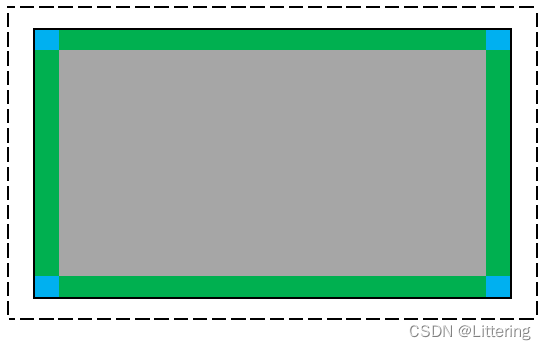

# 简单写作设计说明书

Paragraph.

## BasedFramelessMainWindow类

`BasedFramelessMainWindow` 无边框窗口基类，继承于 `QWidget 类`（主要是 QMainWindow 类已经有一个默认布局，那就需要设置一个中心控件，然后要在中心控件里再做一个布局。要设置阴影效果的话，还要在中心控件里放一个控件用于实际布局，而中心控件用来做阴影效果，属于是套娃套娃）。

设置无边框窗口基类为无边框、透明后，自带阴影效果会消失，所以需要一个容器控件，用于设置阴影，也用于放置实际布局。如下图（从csdn扒下来的）所示，虚线框就是无边框窗口基类，黑实线框就是容器控件，两者之间就是是阴影效果。

设置完无边框后，还需要自己实现窗口的移动和拉伸功能。

- bullet
+ other bullet
* another bullet
    * child bullet

1. ordered
2. next ordered

### Third Level Heading

Some *italic* and **bold** text and `inline code`.

An empty line starts a new paragraph.

Use two spaces at the end  
to force a line break.

A horizontal ruler follows:

---

Add links inline like [this link to the Qt homepage](https://www.qt.io),
or with a reference like [this other link to the Qt homepage][1].

    Add code blocks with
    four spaces at the front.

> A blockquote
> starts with >
>
> and has the same paragraph rules as normal text.

First Level Heading in Alternate Style
======================================

Paragraph.

Second Level Heading in Alternate Style
---------------------------------------

Paragraph.

[1]: https://www.qt.io
